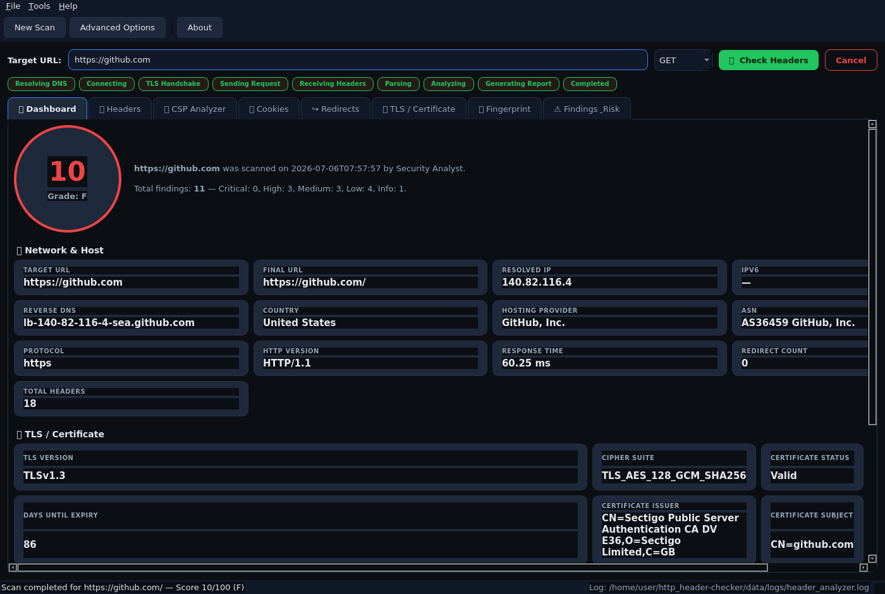
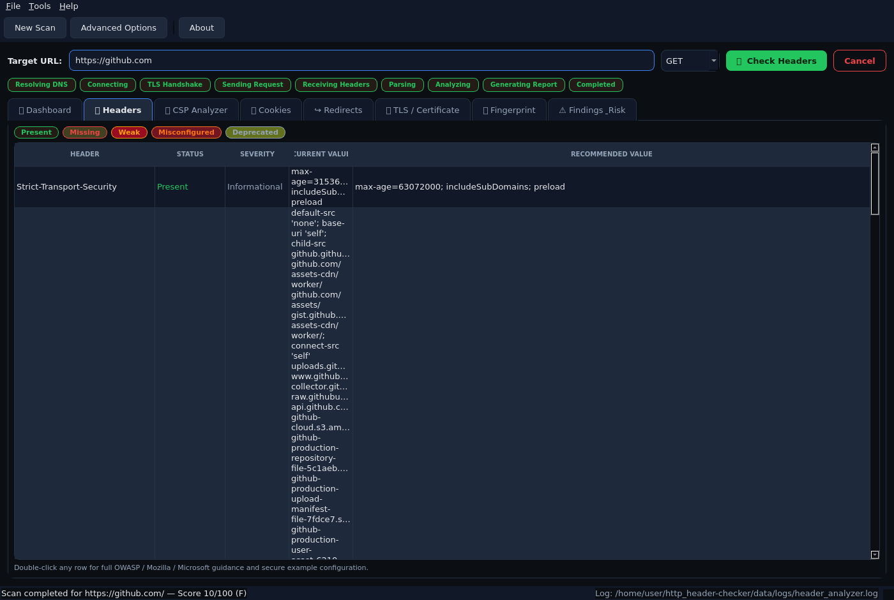
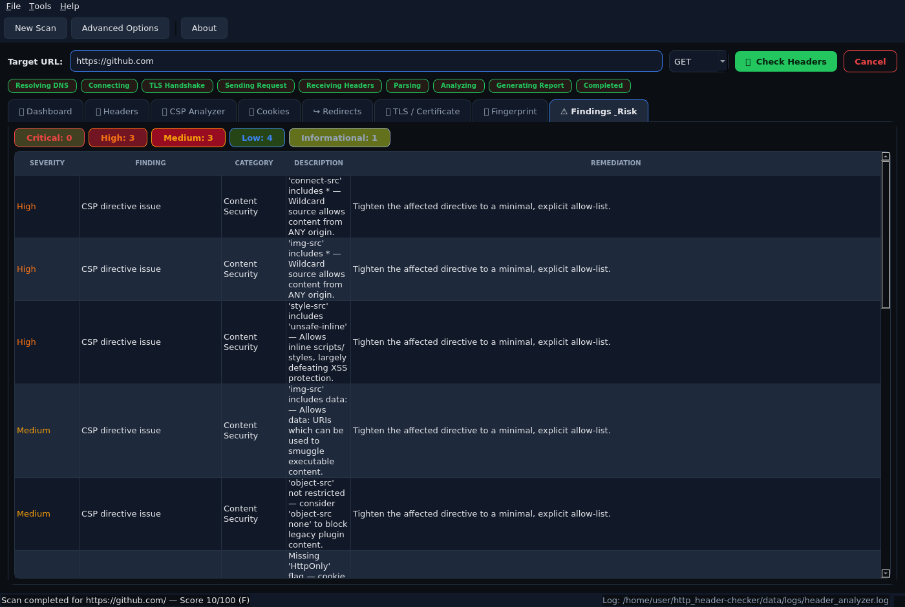

# HTTP Header Checker

A professional, desktop-native **HTTP security header, TLS/certificate, cookie,
redirect and technology fingerprinting analyzer** built with **Python 3** and
**PySide6** — designed for penetration testers, red teamers, vulnerability
assessment engineers, and security auditors.

No Electron. No web app. No JavaScript. A fully native Qt desktop application
with a modular, extensible, enterprise-grade architecture.



---

## ✨ Features

### 🔍 Comprehensive HTTP Header Analysis
Checks 45+ modern and legacy HTTP headers, including all core security
headers (`Strict-Transport-Security`, `Content-Security-Policy`,
`X-Frame-Options`, `X-Content-Type-Options`, `Referrer-Policy`,
`Permissions-Policy`, `Cross-Origin-*-Policy`, etc.) as well as
informational/fingerprinting headers (`Server`, `X-Powered-By`, `Via`,
`Alt-Svc`, CORS headers, caching headers, and more).

For every header, the tool reports:
- Status: **Present / Missing / Weak / Misconfigured / Deprecated**
- Severity: **Critical / High / Medium / Low / Informational**
- Current value vs. recommended secure value
- Why it matters (business impact) + OWASP / Mozilla / Microsoft guidance
- Example secure configuration

### 🧩 Content-Security-Policy (CSP) Analyzer
Parses every CSP directive (`default-src`, `script-src`, `object-src`,
`frame-ancestors`, `base-uri`, `upgrade-insecure-requests`, etc.), flags
dangerous values (`unsafe-inline`, `unsafe-eval`, wildcard sources, `data:`
URIs) and explains each issue.

### 🍪 Cookie Security Analysis
Parses every `Set-Cookie` header and detects missing `Secure` / `HttpOnly`
flags, weak or missing `SameSite`, `SameSite=None` without `Secure`, and
likely session/auth cookies lacking proper protections.

### ↪️ Redirect Chain Analysis
Follows and displays the full redirect chain, detecting HTTPS→HTTP
downgrades, mixed-protocol hops, redirect loops, and excessive chain length.

### 🔐 TLS / Certificate Analysis
Performs an independent TLS handshake to report protocol version, cipher
suite, certificate subject/issuer/SANs, expiry countdown, SHA-256
fingerprint, public key type/size, self-signed/hostname-mismatch detection,
weak cipher/protocol detection, and HSTS preload eligibility heuristics.

### 🖥️ Server & Technology Fingerprinting
Passively fingerprints web servers (Nginx, Apache, IIS, LiteSpeed, Caddy...),
CDNs (Cloudflare, Fastly, CloudFront, Akamai...), reverse proxies,
frameworks (Express, ASP.NET, Laravel...), and CMS platforms (WordPress,
Drupal, Joomla) from headers, cookies, and page content — no intrusive
probing.

### ⚠️ Risk Scoring & Findings Register
Every issue becomes a structured finding with severity, category, business
impact, and remediation guidance. An overall **0–100 security score** with
letter grade (A+ through F) is computed from all findings.

### 🎛️ Advanced Scan Options
Configurable HTTP method (GET/HEAD/OPTIONS), custom headers, Bearer token
auth, cookies, HTTP(S)/SOCKS proxy, timeout & retries, follow/disable
redirects, strict/relaxed SSL verification, User-Agent mode (default /
random / custom), and IPv4/IPv6 resolution preferences.

### 🧵 Fully Non-Blocking UI
All scanning happens on a background `QThread` — the UI never freezes —
with a live stage tracker (Resolving DNS → Connecting → TLS Handshake →
Sending Request → Receiving Headers → Parsing → Analyzing → Completed) and
full cancellation support.

---

## 📸 Screenshots

| Dashboard | Header Analysis | Findings & Risk |
|---|---|---|
|  |  |  |


---

## 🚀 Installation

### Requirements
- Python 3.10+
- pip

### Steps

```bash
# 1. Clone the repository
git clone https://github.com/<your-username>/http_header-checker.git
cd http_header-checker

# 2. (Recommended) Create a virtual environment
python3 -m venv .venv
source .venv/bin/activate      # Windows: .venv\Scripts\activate

# 3. Install dependencies
pip install -r requirements.txt

# 4. Run the application
python main.py
```

### Linux additional system libraries

On minimal Linux distros/containers, Qt requires a few system libraries for
the GUI to render:

```bash
sudo apt-get install -y libxkbcommon0 libxkbcommon-x11-0 libgl1 libegl1 \
    libdbus-1-3 libxcb-cursor0 libxcb-icccm4 libxcb-image0 libxcb-keysyms1 \
    libxcb-randr0 libxcb-render-util0 libxcb-shape0 libxcb-xinerama0 \
    libxcb-xkb1 libnss3 libxcomposite1 libxdamage1 libxrandr2 libasound2t64
```

---

## 📖 User Manual

1. **Enter a target URL** (e.g. `https://example.com`) in the target field.
   The scheme is optional — `https://` is assumed if omitted.
2. Choose the HTTP method (**GET / HEAD / OPTIONS**) from the dropdown.
3. Click **🔍 Check Headers** (or press `Enter`) to start the scan. The
   stage tracker shows live progress; click **Cancel** to abort at any time.
4. Once complete, explore the results across tabs:
   - **📊 Dashboard** — network, TLS, and technology summary + overall score
   - **🛡️ Headers** — full header checklist; double-click any row for deep
     OWASP/Mozilla/Microsoft guidance
   - **🧩 CSP Analyzer** — parsed CSP directives and dangerous-value warnings
   - **🍪 Cookies** — per-cookie flag analysis (Secure/HttpOnly/SameSite/etc.)
   - **↪️ Redirects** — full redirect chain with protocol/downgrade detection
   - **🔐 TLS / Certificate** — handshake details & certificate chain info
   - **🖥️ Fingerprint** — detected server, CDN, framework, CMS, technologies
   - **⚠️ Findings & Risk** — consolidated, severity-ranked risk register
5. Use **Tools → Advanced Scan Options** (`Ctrl+O`) to configure custom
   headers, auth tokens, cookies, proxies, timeouts, redirect behavior, SSL
   verification, and User-Agent strategy before your next scan.
6. Use **Tools → Set Analyst Name** to label who performed the assessment.

### Keyboard Shortcuts

| Shortcut | Action |
|---|---|
| `Ctrl+N` | New scan |
| `Ctrl+O` | Advanced scan options |
| `Ctrl+Q` | Quit |
| `Enter` (in URL field) | Start scan |

---

## ⚠️ Legal / Ethical Use

This tool is intended **only** for authorized security testing — on systems
you own or have explicit written permission to assess. Scanning targets
without authorization may violate computer misuse laws in your jurisdiction.
The authors accept no liability for misuse.

---

## 🛠️ Built With

- [PySide6](https://doc.qt.io/qtforpython/) — native Qt GUI
- [requests](https://docs.python-requests.org/) / [urllib3](https://urllib3.readthedocs.io/) — HTTP networking
- [cryptography](https://cryptography.io/) — X.509 certificate parsing
- [validators](https://github.com/python-validators/validators) — URL validation
- [BeautifulSoup4](https://www.crummy.com/software/BeautifulSoup/) — light HTML parsing for fingerprinting

---

## 📄 License

Released under the [MIT License](LICENSE).

## 🤝 Contributing

Pull requests are welcome! The header knowledge base
(`scanner/header_definitions.py`), fingerprinting signatures
(`scanner/fingerprint.py`), and scoring model (`scanner/scoring.py`) are all
designed to be easily extended — see the module docstrings for guidance.
