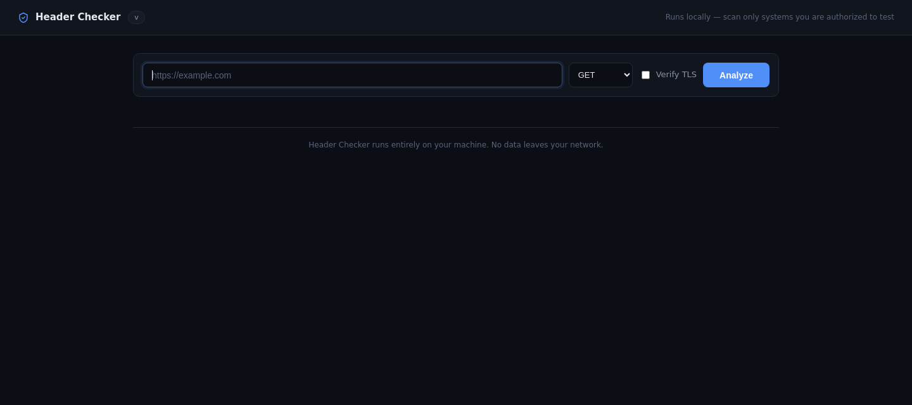
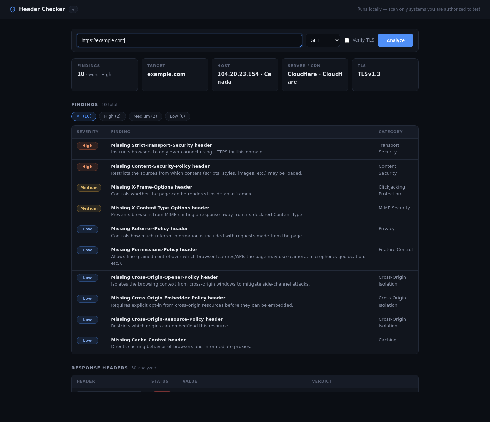

# HTTP Header Checker

A fast, local-first analyzer for HTTP security headers, TLS/certificate
posture, cookies and redirect chains — with a clean CLI and a local web
dashboard.

Built for developers, security engineers and auditors who want to answer one
question clearly: *what is this site missing, why does it matter, and how do
I fix it?*



## Why this tool

Most scanners bury you in jargon and arbitrary numbers. This tool is built
on three principles:

1. **No noise.** Informational observations never masquerade as findings.
   The findings register only contains actionable issues with severities,
   impact and concrete remediation.
2. **Plain language.** Header verdicts are Pass / Warning / Fail / Info —
   each with a one-line explanation of what it means for you.
3. **Local-first.** Everything runs on your machine; no accounts, no
   telemetry, no data leaving your network.

## Features

- **45+ HTTP headers evaluated** against OWASP / Mozilla guidance, including
  HSTS, CSP, X-Frame-Options, X-Content-Type-Options, Referrer-Policy,
  Permissions-Policy and the Cross-Origin isolation headers
- **CSP analysis** — parses directives, flags `unsafe-inline`, wildcards,
  `data:` URIs and structural gaps
- **Cookie analysis** — Secure / HttpOnly / SameSite flags, session-cookie
  risk detection across the whole redirect chain
- **TLS & certificate inspection** — protocol, cipher suite, expiry countdown,
  SANs, self-signed / hostname-mismatch / weak-crypto detection
- **Redirect chain analysis** — HTTPS downgrade, loops, excessive hops
- **Passive technology fingerprinting** — server, CDN, framework, CMS
- **JSON + standalone HTML reports** for documentation and pipelines
- **CI gate mode** — fail your pipeline when findings meet a severity threshold



## Installation

Requires Python 3.10+.

```bash
git clone https://github.com/pintukumar-sutradhar/http_header-checker.git
cd http_header-checker

python3 -m venv .venv
source .venv/bin/activate          # Windows: .venv\Scripts\activate

pip install .
```

Or install straight from GitHub:

```bash
pip install git+https://github.com/pintukumar-sutradhar/http_header-checker.git
```

No compilers, no Qt system libraries, no browser extensions — pure Python.

## Usage

### Web dashboard

```bash
http-header-checker ui --open
```

Opens `http://127.0.0.1:8765` in your browser. Enter a URL, click Scan.
Runs entirely on localhost — no data leaves your machine.

Tip: append `?url=example.com` to auto-start a scan — handy for bookmarks.

### CLI

```bash
# Basic scan with terminal summary
http-header-checker scan https://example.com

# Export reports
http-header-checker scan example.com --json report.json --html report.html

# CI gate: exit code 2 if any High-or-worse finding exists
http-header-checker scan https://example.com --fail-on high

# Common options
http-header-checker scan example.com \
    --method HEAD \
    --timeout 10 \
    --proxy http://127.0.0.1:8080 \
    --verify-ssl \
    --header "X-Request-Id: audit-42" \
    --cookie "session=..." \
    --random-ua
```

Exit codes: `0` success · `1` scan failed · `2` findings met `--fail-on` gate.

### Library use

```python
from header_checker.core.scan_engine import run_scan
from header_checker.utils.models import ScanOptions

result = run_scan("https://example.com", options=ScanOptions(method="HEAD"))
for finding in result.findings:
    print(f"[{finding.severity.value}] {finding.title}")
    print(f"    Fix: {finding.remediation}")
```

## Project structure

```
header_checker/
├── core/            # scanning engine (pure logic, framework-free)
├── web/             # local dashboard (FastAPI + single-page UI)
├── utils/           # data models, constants, logging, networking
├── cli.py           # command-line interface
└── reporting.py     # JSON / HTML / text report rendering
checks/              # verification suite (pytest, no network required)
```

## Development

```bash
pip install -e ".[dev]"
pytest                           # runs the checks/ suite
ruff check header_checker checks # lint
```

To extend the tool, start with the module docstrings in
`header_checker/core/header_definitions.py` (header knowledge base).

## Legal / ethical use

This tool is intended **only** for authorized security testing — systems you
own or have explicit written permission to assess. Scanning targets without
authorization may violate computer misuse laws in your jurisdiction.
The authors accept no liability for misuse.

## License

Released under the [MIT License](LICENSE).

## Acknowledgements

Guidance and reference material from
[OWASP Secure Headers Project](https://owasp.org/www-project-secure-headers/),
[MDN HTTP Headers documentation](https://developer.mozilla.org/en-US/docs/Web/HTTP/Headers)
and the Mozilla HTTP Observatory.
